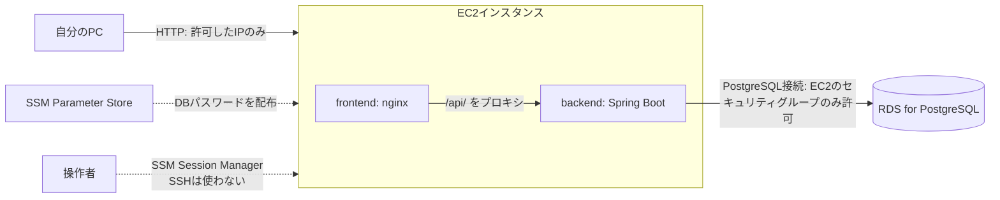

# インフラ構成

本アプリをAWS上で動かす際のインフラ構成・設計方針をまとめる。Terraformで構成をコード化(IaC)しており、手動でのAWSマネジメントコンソール操作は初回のIAMユーザー作成のみを前提とする。

具体的な設定値(インスタンスタイプ・IPアドレス・コスト等)は変更されうるため本書には記載しない。最新の値は`infra/`配下のTerraformコードを参照する。

## 構成図

## 設計方針

- **IaC**: すべてのAWSリソースをTerraform(`infra/`)で管理し、`plan`でレビューしてから`apply`する。
- **サーバーへのアクセス**: SSHは使わず、AWS Systems Manager (SSM) Session Manager経由でEC2にログインする。22番ポートは開放しない。
- **Web公開範囲**: セキュリティグループで許可したグローバルIPからのみ80番ポートへアクセス可能にする。
- **DBアクセス制御**: RDSは`publicly_accessible = false`とし、EC2のセキュリティグループからの接続のみを許可する。NAT Gateway等の固定費が発生する仕組みは使わず、RDS側の設定のみで外部からの到達を遮断する。
- **秘密情報の扱い**: DBパスワードはTerraformで生成し、SSM Parameter Store(SecureString)経由でEC2に配布する。リポジトリやコンテナイメージには平文で残さない。

## ディレクトリ構成

| パス | 役割 |
| --- | --- |
| `infra/` | Terraformコード一式(EC2・RDS・セキュリティグループ・IAMロール・SSM Parameter等の定義) |
| `infra/user_data.sh.tftpl` | EC2初回起動時に実行するセットアップスクリプト(Docker導入、アプリのclone、DB接続情報の取得、コンテナ起動) |
| `backend/Dockerfile` | バックエンド(Spring Boot)のビルド・実行用イメージ |
| `frontend/Dockerfile` | フロントエンド(React)のビルド + nginx配信用イメージ |
| `frontend/nginx.conf` | `/api/`をbackendコンテナへプロキシするnginx設定 |
| `docker-compose.prod.yml` | EC2上でfrontend/backendコンテナを起動する本番用構成 |

## 関連ドキュメント

- [要件定義書](requirements.md): アプリケーションとしてのスコープ・機能要件
- [非機能要件](requirements/non-functional.md): 実行環境・セキュリティ等の要件
