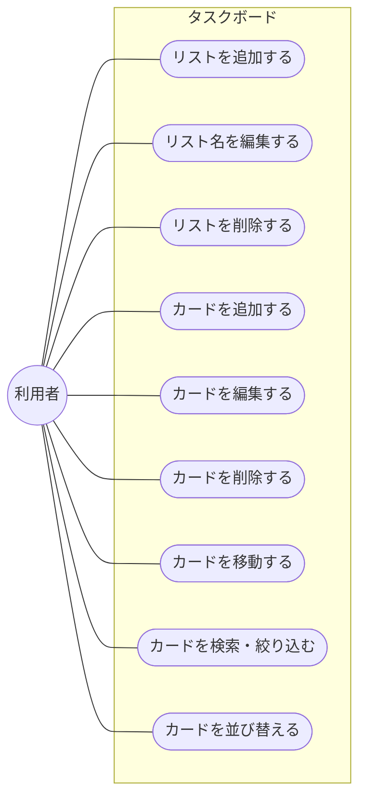

# タスクボード要件定義書

- 作成日: 2026-09-10
- バージョン: 0.8
- 実装方式: Java / Spring Boot（API） + React + Vite（SPA） + PostgreSQL
- 状態: 実装済み（4章の状態欄を参照）

個人利用を想定した、Trello風のシンプルなタスク管理Webアプリの目的・スコープ・機能要件をまとめたドキュメント。以降の機能追加はこの文書を更新しながら進める。

本書はサマリーに絞り、詳細は章ごとに別ファイルへ分けている。各章の「詳細を見る」リンクから該当ドキュメントに移動できる。

## 目次

1. [目的](#1-目的)
2. [想定ユーザー・利用シーン](#2-想定ユーザー利用シーン)
3. [スコープ](#3-スコープ)
4. [機能要件](#4-機能要件)
5. [関連ドキュメント](#5-関連ドキュメント)

## 1. 目的

Trelloのような「リスト × カード」形式のかんばんボードで、個人のタスクを素早く整理できるツールを用意する。まずは最小構成で動くものを作り、実際に使いながら必要な機能を見極めて拡張していく。

## 2. 想定ユーザー・利用シーン

- 個人でタスクを「To Do / 進行中 / 完了」のように分類しながら管理したい利用者。
- チーム共有や外部サービス連携までは不要で、自分専用のボードとして使いたい利用者。
- 1日〜数週間単位の作業を、ドラッグ&ドロップで直感的に動かしながら見通したい場面。

本アプリはログイン等を持たないため、アクターは「利用者」のみ。4章の機能要件と対応するユースケース図は以下の通り。

## 3. スコープ

現バージョンで「作るもの」と「作らないもの」を明確にする。

**対象内**
- 1枚のボード（リストとカードの一覧）
- リストの追加・削除・名称編集
- カードの追加・削除・タイトル編集
- カードの優先度（3段階）・期限日の設定
- カードのドラッグ&ドロップ移動
- カードのキーワード・優先度・所属リストによる検索/絞り込み
- カードの優先度・期日による並び替え
- サーバー（PostgreSQL）へのデータ保存

**対象外**
- ログイン・ユーザーアカウント
- 複数ボードの切り替え
- 複数人での共有・同時編集
- ラベル（色分け）・添付ファイル・説明欄
- 本番環境へのデプロイ・公開運用（現状はローカル開発環境のみ）

## 4. 機能要件

### 4.1 ボード・リスト

| 要件 | 内容 | 状態 |
| --- | --- | --- |
| リスト表示 | ボード上に複数のリストを横並びで表示する。カードが0件のリストも列として表示する。 | 実装済み |
| リスト追加 | ボード右端の「+ リストを追加」から新しいリストを末尾に追加できる。 | 実装済み |
| リスト名編集 | リスト見出しの入力欄を直接編集して名称を変更できる（Enter/フォーカス移動で確定、Escで取消）。 | 実装済み |
| リスト削除 | リスト単位で削除できる。カードの有無に関わらず確認ダイアログを表示し、リスト内のカードもあわせて削除する。 | 実装済み |

### 4.2 カード

| 要件 | 内容 | 状態 |
| --- | --- | --- |
| カード追加 | フォームからリスト・タイトル・優先度・期限日を指定してカードを作成する。 | 実装済み |
| カード編集 | カードをクリックして開く詳細モーダルで、タイトル・優先度・期限日を編集できる。 | 実装済み |
| カード削除 | カード詳細モーダルから削除できる。 | 実装済み |
| カード移動 | ドラッグ&ドロップで同一リスト内の並べ替え、および他のリスト（空のリストを含む）への移動ができる。 | 実装済み |
| 優先度設定 | カードごとに優先度を「高・中・低」の3段階で設定し、色（赤・黄・緑）で可視化する。 | 実装済み |
| 期限設定 | カードごとに期限日を設定できる。期限日を過ぎたカードは強調表示する。 | 実装済み |

### 4.3 検索・並び替え

| 要件 | 内容 | 状態 |
| --- | --- | --- |
| キーワード検索 | カードのタイトルを部分一致で検索する。 | 実装済み |
| 優先度による絞り込み | 優先度（高・中・低）でカードを絞り込む。 | 実装済み |
| リストによる絞り込み | 所属リストIDでカードを絞り込む。 | 実装済み |
| 並び替え | 優先度順・期限順でリスト内のカードを並び替える。 | 実装済み |

### 4.4 データ保存

| 要件 | 内容 | 状態 |
| --- | --- | --- |
| サーバー保存 | 操作の都度、バックエンドAPI経由でPostgreSQLにデータを保存する。 | 実装済み |
| 復元 | ページを再読み込みしても、サーバー上の最新状態を取得して表示する。 | 実装済み |

## 5. 関連ドキュメント

サマリーに含めていない詳細は、以下の個別ドキュメントを参照。

| ドキュメント | 内容 |
| --- | --- |
| [非機能要件](requirements/non-functional.md) | 実行環境・対応ブラウザ、セキュリティ、アクセシビリティ、対応デバイス・画面幅、障害時の挙動 |
| [画面構成](requirements/screens.md) | ワイヤーフレーム、操作フロー図 |
| [データモデル](requirements/data-model.md) | DBのER図（boards / lists / cards） |
| [制約・前提条件 / 今後の拡張候補](requirements/roadmap.md) | データ保存範囲の制約、優先度付き拡張候補一覧 |
| [技術スタック](requirements/tech-stack.md) | 採用技術とバージョン一覧 |
| [改訂履歴](requirements/changelog.md) | バージョンごとの変更内容（全件） |
| [backend/README.md](../backend/README.md) | バックエンドの起動・疎通確認・DB接続設定 |
| [frontend/README.md](../frontend/README.md) | フロントエンドの起動・テスト・既知の制約 |

---

対象コード: `backend/`（Spring Boot API）・`frontend/`（React + Vite SPA）。機能を追加・変更するたびに、この文書と各詳細ドキュメントのスコープ・要件も合わせて更新する。
