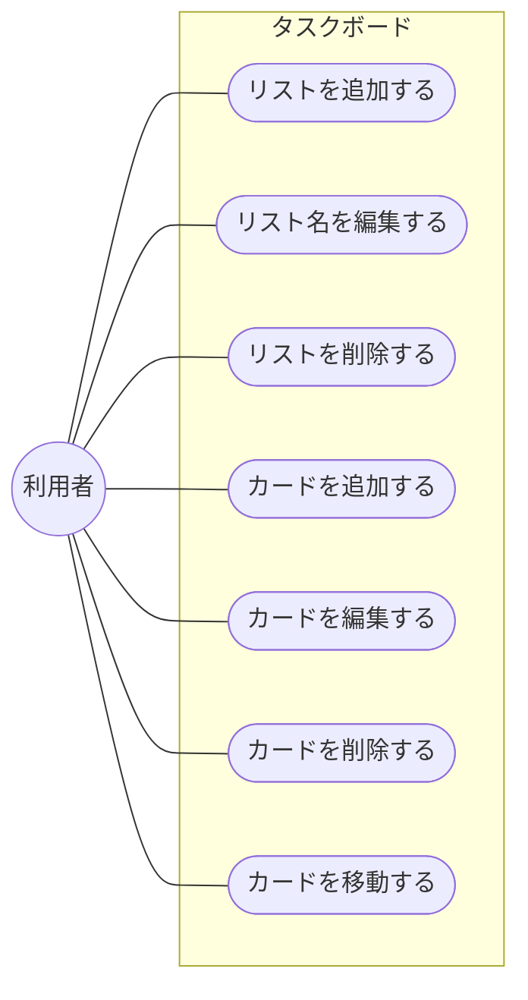
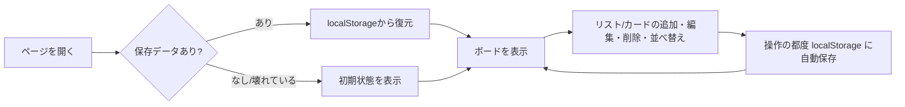
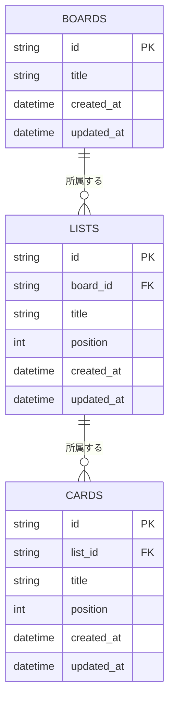

# タスクボード要件定義書

- 作成日: 2026-09-10
- バージョン: 0.4
- 実装方式: HTML / CSS / JavaScript（サーバーレス）
- 状態: MVP実装済み

個人利用を想定した、Trello風のシンプルなタスク管理Webアプリの目的・スコープ・機能要件をまとめたドキュメント。以降の機能追加はこの文書を更新しながら進める。

## 目次

1. [目的](#1-目的)
2. [想定ユーザー・利用シーン](#2-想定ユーザー利用シーン)
3. [スコープ](#3-スコープ)
4. [機能要件](#4-機能要件)
5. [非機能要件](#5-非機能要件)
6. [画面構成](#6-画面構成)
7. [データモデル](#7-データモデル)
8. [制約・前提条件](#8-制約前提条件)
9. [今後の拡張候補](#9-今後の拡張候補)
10. [改訂履歴](#10-改訂履歴)

## 1. 目的

Trelloのような「リスト × カード」形式のかんばんボードで、個人のタスクを素早く整理できるツールを、インストールや会員登録なしにブラウザだけで使える形で用意する。まずは最小構成で動くものを作り、実際に使いながら必要な機能を見極めて拡張していく。

## 2. 想定ユーザー・利用シーン

- 個人でタスクを「To Do / 進行中 / 完了」のように分類しながら管理したい利用者。
- チーム共有や外部サービス連携までは不要で、まず自分のPC・ブラウザ上で完結させたい利用者。
- 1日〜数週間単位の作業を、ドラッグ&ドロップで直感的に動かしながら見通したい場面。

### 2.1 ユースケース図

アクター（利用者）と、4章の機能要件に対応するユースケースの関係を示す。本アプリはログイン等を持たないため、アクターは「利用者」のみとなる。



各ユースケースは4章「機能要件」の各行に対応する。ユースケース間の依存関係（例: カードの移動には移動元・移動先の2つのリストが存在すること）は表現していない。

## 3. スコープ

今回のバージョン（v0.1）で「作るもの」と「作らないもの」を明確にする。

**対象内**
- 1枚のボード（リストとカードの一覧）
- リストの追加・削除・名称編集
- カードの追加・削除・タイトル編集
- カードのドラッグ&ドロップ移動
- ブラウザへのデータ自動保存

**対象外**
- ログイン・ユーザーアカウント
- 複数ボードの切り替え
- 複数人での共有・同時編集
- 期限日・ラベル・添付ファイル
- サーバーへのデータ同期

## 4. 機能要件

### 4.1 ボード・リスト

| 要件 | 内容 | 状態 |
| --- | --- | --- |
| リスト表示 | ボード上に複数のリストを横並びで表示する。初期状態は「To Do / 進行中 / 完了」の3列。 | 実装済み |
| リスト追加 | 「+ リストを追加」から新しいリストを末尾に追加できる。 | 実装済み |
| リスト名編集 | リスト見出しをクリックして直接名称を変更できる。 | 実装済み |
| リスト削除 | リスト単位で削除できる。カードが入っている場合は確認ダイアログを表示する。 | 実装済み |

### 4.2 カード

| 要件 | 内容 | 状態 |
| --- | --- | --- |
| カード追加 | 各リスト下部の「+ カードを追加」から空のカードを作成し、そのまま入力できる。 | 実装済み |
| カード編集 | カードのテキストをクリックして直接書き換えられる。 | 実装済み |
| カード削除 | カード右上の「✕」から個別に削除できる。 | 実装済み |
| カード移動 | ドラッグ&ドロップで同一リスト内の並べ替え、および他のリストへの移動ができる。 | 実装済み |

### 4.3 データ保存

| 要件 | 内容 | 状態 |
| --- | --- | --- |
| 自動保存 | 操作の都度、ボードの状態を `localStorage` に保存する。 | 実装済み |
| 復元 | ページを再読み込みしても、直前の状態がそのまま復元される。 | 実装済み |

## 5. 非機能要件

- **実行環境:** インターネット接続・サーバーを必要とせず、`index.html` を開くだけで動作する。
- **対応ブラウザ:** Chrome / Edge / Firefox / Safari の最新版を対象とする（`structuredClone` 等のモダンAPIを使用）。
- **パフォーマンス:** 静的ファイルのみで構成し、体感的な待ち時間が発生しない軽量さを保つ。
- **操作性:** クリックだけでリスト名・カード名を編集でき、キーボード操作（Enterで確定）にも対応する。
- **堅牢性:** 保存データが壊れている・存在しない場合は初期状態にフォールバックする。

### 5.1 セキュリティ

- 外部サーバーとの通信を一切行わないため、通信経路上でのデータ漏えいは発生しない。
- リスト名・カードの内容は `<input>` 要素の `value` として扱い、`innerHTML` 等でHTMLとして解釈させる実装は行わない（意図しないタグ・スクリプトの埋め込みは無効化される）。
- 保存データは `JSON.parse` で読み込むのみで、実行可能なコードとして扱わない。
- `localStorage` は同一オリジンの他スクリプトからも読み書き可能な領域であるため、パスワード等の機密情報の保存は想定しない。

### 5.2 アクセシビリティ

- リスト名・カードは `<input>` 要素で実装しているため、Tabキーによるフォーカス移動やスクリーンリーダーでの読み上げの土台は確保されている。
- 一方、削除ボタン（✕）などのアイコンのみのボタンには `aria-label` を付与しておらず、`title` 属性のみに留まる。支援技術での識別性は限定的。
- カード移動はHTML5 Drag and Drop APIのみに依存しており、キーボード操作による代替手段（矢印キーでの移動など）は提供しない。
- 対応レベル: 本バージョンではWCAG等の達成基準への準拠は目標としない。

### 5.3 対応デバイス・画面幅

- PCでのマウス操作を前提としたレイアウトとする。リスト幅は260px固定で、ボード全体は横スクロールで対応する。
- メディアクエリによるレスポンシブ対応は行わない（`style.css` にブレークポイントは存在しない）。
- スマートフォン・タブレットでの利用は対象外とする。特にカードの移動はHTML5 Drag and Drop APIに依存しており、タッチ操作では動作しない。
- 想定する最小画面幅は1024px程度とする。

### 5.4 非対応環境時の挙動

- `structuredClone` など本アプリが使用するモダンAPIに対応しない古いブラウザで開いた場合、エラー画面や警告表示は行わず、機能が動作しない状態になる（明示的なフォールバックは提供しない）。
- JavaScriptが無効な環境では、ボード領域が空のまま表示される（noscript対応は行わない）。

## 6. 画面構成

画面はヘッダーとボードのみのシングルページ構成とする。

- **ヘッダー:** アプリ名を表示する固定バー。
- **ボード領域:** リストを横方向にスクロール可能な形で並べる。各リストは「見出し（編集可）＋カード一覧＋カード追加ボタン」で構成する。
- **リスト追加:** ボード最右端に常に「+ リストを追加」ボタンを表示する。

### 6.1 ワイヤーフレーム

```
┌──────────────────────────────────────────────────────────────────┐
│ 📋 Task Board                                                     │ ← ヘッダー（固定）
├──────────────────────────────────────────────────────────────────┤
│ ┌─────────────┐  ┌─────────────┐  ┌─────────────┐  ┌────────────┐│
│ │ To Do    ✕  │  │ 進行中   ✕  │  │ 完了     ✕  │  │+ リストを  ││
│ ├─────────────┤  ├─────────────┤  ├─────────────┤  │  追加      ││
│ │ サンプル1 ✕ │  │             │  │             │  └────────────┘│
│ │ サンプル2 ✕ │  │             │  │             │                │
│ │             │  │             │  │             │                │
│ │+ カードを追加│  │+ カードを追加│  │+ カードを追加│                │
│ └─────────────┘  └─────────────┘  └─────────────┘                │
│        ←──────────── 横スクロール可能 ────────────→               │
└──────────────────────────────────────────────────────────────────┘
```

- リスト見出し・カードはクリックすると直接編集できるテキストボックスになる（別画面やモーダルは開かない）。
- カードはドラッグ中、掴んでいる位置に応じて挿入位置のプレビュー（枠線のハイライト）を表示する。

### 6.2 操作フロー



## 7. データモデル

### 7.1 現在のデータモデル（localStorage / JSON）

状態はひとつのJSONオブジェクトとして保持し、`localStorage` のキー `task-board-state-v1` に文字列化して保存する。

```json
{
  "lists": [
    {
      "id": "string (一意なID)",
      "title": "string",
      "cards": [
        { "id": "string (一意なID)", "title": "string" }
      ]
    }
  ]
}
```

リスト・カードの並び順は配列の並び順そのものが表す。IDは追加時に生成し、削除・移動時にも変更しない。ボードは1つのみで、ボード自体をIDで管理する概念は持たない。

### 7.2 DB移行を見据えたER図（将来構成）

将来、`localStorage` から実際のデータベース（RDB）へ移行し、サーバー経由で運用することを見据えた場合のテーブル構成を以下に示す。現行スコープ（単一ボード・単一ユーザー・ログインなし）に合わせた最小構成とし、`boards` テーブルもあらかじめ用意することで、9章の拡張候補にある複数ボード対応への移行時にテーブル追加なしで対応できるようにする。



**現行モデルとの主な差分**

- `position`（並び順）列を明示的に追加する。現行はJSON配列の並び順がそのまま順序を表すが、RDBのテーブル行には順序の保証がないため、順序を保持する列が別途必要になる。
- `created_at` / `updated_at` を追加する。DB運用では作成・更新日時の記録が一般的なため、現行モデルにはない項目として加える。
- `boards` テーブルを新設する。現行は暗黙的に「ボードは1つ」だが、DBでは明示的な行として管理する。ただし本バージョンのスコープでは1ユーザー1ボード運用とし、`users` テーブルやログイン機能の追加は行わない（9章「今後の拡張候補」で別途検討）。
- ER図上のカーディナリティは「1つのボードは0件以上のリストを持つ／1つのリストは0件以上のカードを持つ」（`||--o{`）という1対多の関係を表す。

## 8. 制約・前提条件

**データはブラウザ単位。** 保存先は利用中のブラウザ・端末の `localStorage` のみ。別の端末やブラウザ、シークレットウィンドウでは別データになり、ブラウザの閲覧データを削除すると内容も消える。バックアップやマルチデバイス同期は現時点で提供しない。

## 9. 今後の拡張候補

優先度の目安つきで、想定される拡張を列挙する。実装するかどうかは都度判断する。

| 優先度 | 候補機能 |
| --- | --- |
| 高 | カードの説明欄・期限日・ラベル（色分け） |
| 高 | 完了したタスクのアーカイブ表示 |
| 中 | 複数ボードの作成・切り替え、カードの検索・絞り込み |
| 低 | バックエンド（サーバー・DB）導入によるマルチデバイス同期 |
| 低 | ユーザー認証、複数人での共有・共同編集 |

## 10. 改訂履歴

| バージョン | 日付 | 内容 |
| --- | --- | --- |
| 0.1 | 2026-09-10 | 初版作成。MVP（HTML/CSS/JS + localStorage）の実装内容を反映。 |
| 0.2 | 2026-09-10 | 非機能要件を詳細化（セキュリティ・アクセシビリティ・対応デバイス・非対応環境時の挙動）。画面構成にワイヤーフレームと操作フロー図を追加。 |
| 0.3 | 2026-09-10 | データモデル章を現行モデル（7.1）とDB移行を見据えたER図（7.2）に分割。将来のRDB移行を想定したテーブル構成（boards / lists / cards）を追加。 |
| 0.4 | 2026-09-10 | 2章にユースケース図を追加。アクター「利用者」と機能要件（4章）に対応するユースケースの関係を明示。 |

---

対象コード: `index.html` / `style.css` / `app.js`（プロジェクトルート直下）。機能を追加・変更するたびに、この文書のスコープと機能要件も合わせて更新する。
