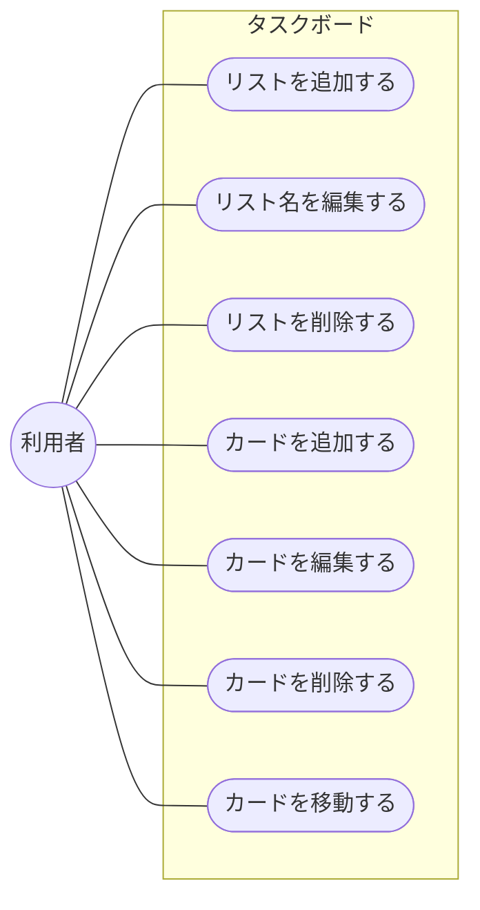

# タスクボード要件定義書

- 作成日: 2026-09-10
- バージョン: 0.5
- 実装方式: HTML / CSS / JavaScript（サーバーレス）
- 状態: MVP実装済み

個人利用を想定した、Trello風のシンプルなタスク管理Webアプリの目的・スコープ・機能要件をまとめたドキュメント。以降の機能追加はこの文書を更新しながら進める。

本書はサマリーに絞り、詳細は章ごとに別ファイルへ分けている。各章の「詳細を見る」リンクから該当ドキュメントに移動できる。

## 目次

1. [目的](#1-目的)
2. [想定ユーザー・利用シーン](#2-想定ユーザー利用シーン)
3. [スコープ](#3-スコープ)
4. [機能要件](#4-機能要件)
5. [関連ドキュメント](#5-関連ドキュメント)

## 1. 目的

Trelloのような「リスト × カード」形式のかんばんボードで、個人のタスクを素早く整理できるツールを、インストールや会員登録なしにブラウザだけで使える形で用意する。まずは最小構成で動くものを作り、実際に使いながら必要な機能を見極めて拡張していく。

## 2. 想定ユーザー・利用シーン

- 個人でタスクを「To Do / 進行中 / 完了」のように分類しながら管理したい利用者。
- チーム共有や外部サービス連携までは不要で、まず自分のPC・ブラウザ上で完結させたい利用者。
- 1日〜数週間単位の作業を、ドラッグ&ドロップで直感的に動かしながら見通したい場面。

本アプリはログイン等を持たないため、アクターは「利用者」のみ。4章の機能要件と対応するユースケース図は以下の通り。

## 3. スコープ

今回のバージョン（v0.1）で「作るもの」と「作らないもの」を明確にする。

**対象内**
- 1枚のボード（リストとカードの一覧）
- リストの追加・削除・名称編集
- カードの追加・削除・タイトル編集
- カードのドラッグ&ドロップ移動
- ブラウザへのデータ自動保存

**対象外**
- ログイン・ユーザーアカウント
- 複数ボードの切り替え
- 複数人での共有・同時編集
- 期限日・ラベル・添付ファイル
- サーバーへのデータ同期

## 4. 機能要件

### 4.1 ボード・リスト

| 要件 | 内容 | 状態 |
| --- | --- | --- |
| リスト表示 | ボード上に複数のリストを横並びで表示する。初期状態は「To Do / 進行中 / 完了」の3列。 | 実装済み |
| リスト追加 | 「+ リストを追加」から新しいリストを末尾に追加できる。 | 実装済み |
| リスト名編集 | リスト見出しをクリックして直接名称を変更できる。 | 実装済み |
| リスト削除 | リスト単位で削除できる。カードが入っている場合は確認ダイアログを表示する。 | 実装済み |

### 4.2 カード

| 要件 | 内容 | 状態 |
| --- | --- | --- |
| カード追加 | 各リスト下部の「+ カードを追加」から空のカードを作成し、そのまま入力できる。 | 実装済み |
| カード編集 | カードのテキストをクリックして直接書き換えられる。 | 実装済み |
| カード削除 | カード右上の「✕」から個別に削除できる。 | 実装済み |
| カード移動 | ドラッグ&ドロップで同一リスト内の並べ替え、および他のリストへの移動ができる。 | 実装済み |

### 4.3 データ保存

| 要件 | 内容 | 状態 |
| --- | --- | --- |
| 自動保存 | 操作の都度、ボードの状態を `localStorage` に保存する。 | 実装済み |
| 復元 | ページを再読み込みしても、直前の状態がそのまま復元される。 | 実装済み |

## 5. 関連ドキュメント

サマリーに含めていない詳細は、以下の個別ドキュメントを参照。

| ドキュメント | 内容 |
| --- | --- |
| [非機能要件](requirements/non-functional.md) | 実行環境・対応ブラウザ、セキュリティ、アクセシビリティ、対応デバイス・画面幅、非対応環境時の挙動 |
| [画面構成](requirements/screens.md) | ワイヤーフレーム、操作フロー図 |
| [データモデル](requirements/data-model.md) | 現行の `localStorage` / JSONモデル、DB移行を見据えたER図 |
| [制約・前提条件 / 今後の拡張候補](requirements/roadmap.md) | データ保存範囲の制約、優先度付き拡張候補一覧 |
| [改訂履歴](requirements/changelog.md) | バージョンごとの変更内容（全件） |

---

対象コード: `index.html` / `style.css` / `app.js`（プロジェクトルート直下）。機能を追加・変更するたびに、この文書と各詳細ドキュメントのスコープ・要件も合わせて更新する。
