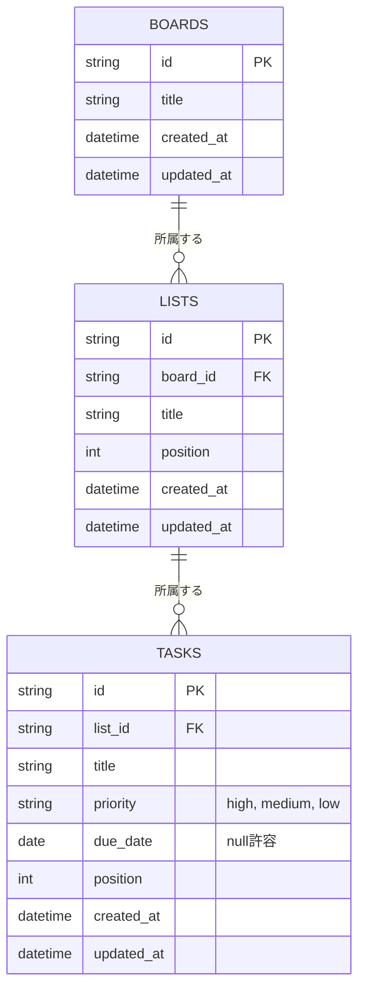

# データモデル

[← 要件定義書に戻る](../requirements.md)

## ER図（`backend/` / `frontend/` で実装済み）

サーバー（PostgreSQL）で管理するテーブル構成。現行スコープ（単一ボード・単一ユーザー・ログインなし）に合わせた最小構成とし、`boards` テーブルもあらかじめ用意することで、[拡張候補](roadmap.md)にある複数ボード対応への移行時にテーブル追加なしで対応できるようにしている。

- `position`（並び順）は、リスト内のタスクの表示順・リスト自体の表示順を表す整数。追加時は末尾（現在の件数）に採番し、削除・移動・並び替え時に該当範囲を詰め直す。
- `created_at` / `updated_at` は行の作成・更新日時。
- ER図上のカーディナリティは「1つのボードは0件以上のリストを持つ／1つのリストは0件以上のタスクを持つ」（`||--o{`）という1対多の関係を表す。
- `priority` はタスクの優先度を3段階（`high` / `medium` / `low`）で表す。`due_date` はタスクの期限日で、未設定は `null`。期限日が本日より過去の場合、画面上は期限超過として強調表示する。

## 実装（`backend/`）とこのER図との差分

- 主キーはこの図では `string` としているが、実装では `Long`（`GenerationType.IDENTITY` による自動採番）を採用している。
- `Board` に対するREST APIは未実装（`GET /api/lists`・`/api/tasks` 系のみ実装済み）。現状は1ボード運用のため、`Board` エンティティはあってもAPIからは直接操作しない（[backend/README.md](../../backend/README.md)の「今後の予定」を参照）。

---

[← 要件定義書に戻る](../requirements.md)
