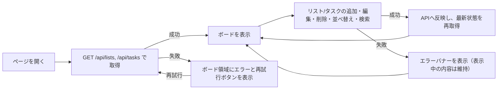

# 画面構成

[← 要件定義書に戻る](../requirements.md)

画面はヘッダー・操作バー・ボードで構成するシングルページ構成とする。

- **ヘッダー:** アプリ名を表示する固定バー。
- **タスク登録フォーム:** 登録先リスト・タイトル・優先度・期限日を指定してタスクを新規作成する。
- **検索バー:** キーワード（タイトル部分一致）・優先度・リストIDでタスクを絞り込む。
- **並び替えバー:** 「優先度順」「期限順」のボタンで、各リスト内のタスクを一括で並び替える。
- **ボード領域:** リストを横方向にスクロール可能な形で並べる。各リストは「見出し（編集可）＋削除ボタン＋タスク一覧」で構成する。タスクが0件のリストも列として表示し、ドロップ先にできる。
- **タスク:** タイトルに加え、優先度（高・中・低の3段階）と期限日を持つ。優先度はタスク左端の色帯（赤＝高／黄＝中／緑＝低）で可視化し、期限日はタスク下部に表示する。期限日が本日より過去の場合は赤字・強調表示で期限超過を知らせる。
- **タスク詳細モーダル:** タスクをクリックすると開き、タイトル・優先度・期限日の編集、および削除ができる。
- **リスト追加:** ボード最右端に常に「+ リストを追加」の入力欄とボタンを表示する。
- **エラー表示:** 初回読み込み失敗時はボード領域に、操作失敗時は画面上部のバナーに、それぞれエラー内容を表示する（詳細は[非機能要件](non-functional.md#障害時の挙動)を参照）。

## ワイヤーフレーム

```
┌──────────────────────────────────────────────────────────────────┐
│ 📋 Task Board                                                     │ ← ヘッダー（固定）
├──────────────────────────────────────────────────────────────────┤
│ [リスト▾][タイトル____][優先度▾][期限日__] [登録]                  │ ← タスク登録フォーム
│ [キーワード______][優先度▾][リストID__]                            │ ← 検索バー
│ 並び替え: [優先度順] [期限順]                                       │ ← 並び替えバー
├──────────────────────────────────────────────────────────────────┤
│ ┌─────────────┐  ┌─────────────┐  ┌─────────────┐  ┌────────────┐│
│ │ To Do    ✕  │  │ 進行中   ✕  │  │ 完了     ✕  │  │新しいリスト││
│ ├─────────────┤  ├─────────────┤  ├─────────────┤  │名 [+追加]  ││
│ │┃サンプル1    │  │             │  │             │  └────────────┘│
│ │┃🔴高 期限:-- │  │             │  │             │                │
│ │┃サンプル2    │  │             │  │             │                │
│ │┃🟡中 期限:-- │  │             │  │             │                │
│ └─────────────┘  └─────────────┘  └─────────────┘                │
│        ←──────────── 横スクロール可能 ────────────→               │
└──────────────────────────────────────────────────────────────────┘
```

- リスト見出しはクリックすると直接編集できるテキストボックスになる。
- タスクをクリックするとタスク詳細モーダルが開き、タイトル・優先度・期限日を編集、または削除できる。
- タスクはドラッグ中、掴んでいる位置に応じて挿入位置のプレビュー（枠線のハイライト）を表示する。

## 操作フロー



---

[← 要件定義書に戻る](../requirements.md)
