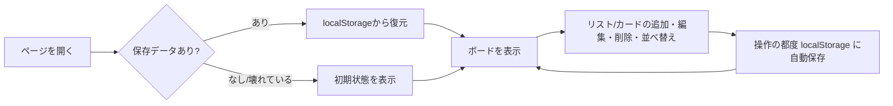

# 画面構成

[← 要件定義書に戻る](../requirements.md)

画面はヘッダーとボードのみのシングルページ構成とする。

- **ヘッダー:** アプリ名を表示する固定バー。
- **ボード領域:** リストを横方向にスクロール可能な形で並べる。各リストは「見出し（編集可）＋カード一覧＋カード追加ボタン」で構成する。
- **カード:** タイトルに加え、優先度（高・中・低の3段階）と期限日を持つ。優先度はカード左端の色帯（赤＝高／黄＝中／緑＝低）で可視化し、期限日は入力欄をカード下部に表示する。期限日が本日より過去の場合は赤字・強調表示で期限超過を知らせる。
- **リスト追加:** ボード最右端に常に「+ リストを追加」ボタンを表示する。

## ワイヤーフレーム

```
┌──────────────────────────────────────────────────────────────────┐
│ 📋 Task Board                                                     │ ← ヘッダー（固定）
├──────────────────────────────────────────────────────────────────┤
│ ┌─────────────┐  ┌─────────────┐  ┌─────────────┐  ┌────────────┐│
│ │ To Do    ✕  │  │ 進行中   ✕  │  │ 完了     ✕  │  │+ リストを  ││
│ ├─────────────┤  ├─────────────┤  ├─────────────┤  │  追加      ││
│ │┃サンプル1 ✕ │  │             │  │             │  └────────────┘│
│ │┃🔴高 期限:-- │  │             │  │             │                │
│ │┃サンプル2 ✕ │  │             │  │             │                │
│ │┃🟡中 期限:-- │  │             │  │             │                │
│ │+ カードを追加│  │+ カードを追加│  │+ カードを追加│                │
│ └─────────────┘  └─────────────┘  └─────────────┘                │
│        ←──────────── 横スクロール可能 ────────────→               │
└──────────────────────────────────────────────────────────────────┘
```

- リスト見出し・カードタイトルはクリックすると直接編集できるテキストボックスになる（別画面やモーダルは開かない）。優先度はカード内のセレクトボックス、期限日はカード内の日付入力欄で、その場で変更できる。
- カードはドラッグ中、掴んでいる位置に応じて挿入位置のプレビュー（枠線のハイライト）を表示する。

## 操作フロー



---

[← 要件定義書に戻る](../requirements.md)
