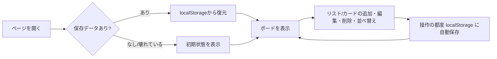

# 画面構成

[← 要件定義書に戻る](../requirements.md)

画面はヘッダーとボードのみのシングルページ構成とする。

- **ヘッダー:** アプリ名を表示する固定バー。
- **ボード領域:** リストを横方向にスクロール可能な形で並べる。各リストは「見出し（編集可）＋カード一覧＋カード追加ボタン」で構成する。
- **リスト追加:** ボード最右端に常に「+ リストを追加」ボタンを表示する。

## ワイヤーフレーム

```
┌──────────────────────────────────────────────────────────────────┐
│ 📋 Task Board                                                     │ ← ヘッダー（固定）
├──────────────────────────────────────────────────────────────────┤
│ ┌─────────────┐  ┌─────────────┐  ┌─────────────┐  ┌────────────┐│
│ │ To Do    ✕  │  │ 進行中   ✕  │  │ 完了     ✕  │  │+ リストを  ││
│ ├─────────────┤  ├─────────────┤  ├─────────────┤  │  追加      ││
│ │ サンプル1 ✕ │  │             │  │             │  └────────────┘│
│ │ サンプル2 ✕ │  │             │  │             │                │
│ │             │  │             │  │             │                │
│ │+ カードを追加│  │+ カードを追加│  │+ カードを追加│                │
│ └─────────────┘  └─────────────┘  └─────────────┘                │
│        ←──────────── 横スクロール可能 ────────────→               │
└──────────────────────────────────────────────────────────────────┘
```

- リスト見出し・カードはクリックすると直接編集できるテキストボックスになる（別画面やモーダルは開かない）。
- カードはドラッグ中、掴んでいる位置に応じて挿入位置のプレビュー（枠線のハイライト）を表示する。

## 操作フロー



---

[← 要件定義書に戻る](../requirements.md)
